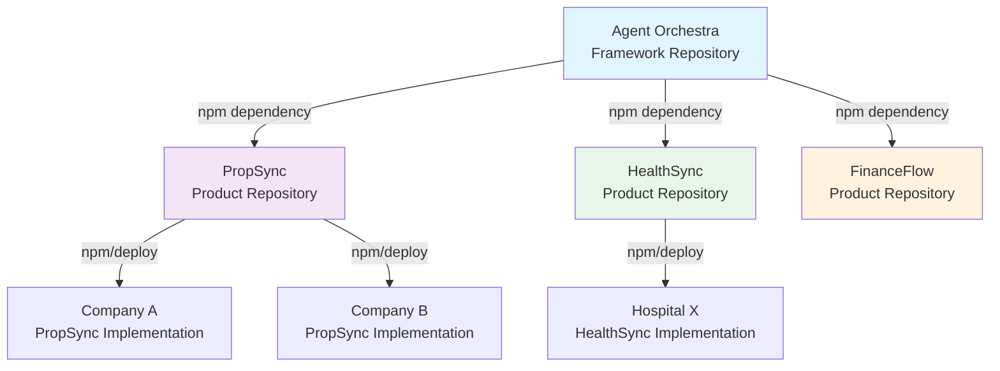

# Agent Orchestra Architecture & Implementation Guide

## Table of Contents
1. [Overview](#overview)
2. [Architecture Philosophy](#architecture-philosophy)
3. [Repository Structure Strategy](#repository-structure-strategy)
4. [Building Domain Solutions](#building-domain-solutions)
5. [PropSync Case Study](#propsync-case-study)
6. [Best Practices](#best-practices)
7. [Common Patterns](#common-patterns)
8. [Migration Strategies](#migration-strategies)

## Overview

Agent Orchestra is designed as a **foundational framework** for building multi-protocol orchestration solutions. This guide explains how to properly architect solutions using Agent Orchestra as the core engine while maintaining clean separation of concerns.

## Architecture Philosophy

### Core Principles

1. **Framework vs Application**
   - Agent Orchestra = Framework (like Express.js, Spring Boot, Django)
   - Domain Solutions = Applications (like PropSync, HealthSync, FinanceFlow)

2. **Separation of Concerns**
   ```
   Generic Orchestration Layer (Agent Orchestra)
           ↓
   Domain-Specific Logic (PropSync, HealthSync)
           ↓
   Business Implementation (Your Company)
   ```

3. **Dependency Direction**
   - Domain solutions depend on Agent Orchestra
   - Agent Orchestra NEVER depends on domain solutions
   - Business implementations depend on domain solutions

## Repository Structure Strategy

### Why Separate Repositories?

#### ❌ What NOT to Do: Branches for Domains
```bash
# WRONG APPROACH
agent-orchestra/
  ├── master           # Base framework
  ├── property-mgmt    # PropSync features
  ├── healthcare       # HealthSync features
  └── finance          # FinanceFlow features
```

**Problems with this approach:**
- Version conflicts between domains
- Bloated codebase
- Unclear ownership
- Dependency nightmares
- Cannot install just what you need

#### ✅ Correct Approach: Separate Repositories
```bash
# RIGHT APPROACH
agent-orchestra/       # Core framework only
propsync/             # Separate product
healthsync/           # Separate product
financeflow/          # Separate product
```

**Benefits:**
- Clean dependency management
- Independent versioning
- Clear ownership and branding
- Focused documentation
- Smaller, faster installations

### Repository Relationships



## Building Domain Solutions

### Step 1: Create New Repository

```bash
# Create your domain solution
mkdir propsync
cd propsync
git init

# Initialize package
npm init -y
```

### Step 2: Structure Your Domain Solution

```
propsync/
├── src/
│   ├── core/                 # PropSync core logic
│   │   ├── PropSyncEngine.ts
│   │   └── config.ts
│   ├── integrations/         # Property-specific integrations
│   │   ├── propertyware/
│   │   ├── servicefusion/
│   │   ├── greenlight/
│   │   └── buildium/
│   ├── workflows/            # Property management workflows
│   │   ├── maintenance/
│   │   ├── tenant/
│   │   ├── accounting/
│   │   └── reporting/
│   ├── api/                  # PropSync REST/GraphQL API
│   │   ├── rest/
│   │   └── graphql/
│   ├── ui/                   # PropSync dashboard
│   │   ├── components/
│   │   └── pages/
│   └── index.ts
├── docs/                      # PropSync-specific docs
├── examples/                  # PropSync examples
├── tests/
├── package.json
└── README.md
```

### Step 3: Install Agent Orchestra

```json
// package.json
{
  "name": "@propsync/core",
  "version": "1.0.0",
  "description": "Property Management Orchestration Platform",
  "dependencies": {
    "@agent-orchestra/core": "^2.0.0",  // Core dependency
    "propertyware-sdk": "^1.0.0",
    "servicefusion-api": "^2.0.0",
    // ... other PropSync-specific dependencies
  }
}
```

### Step 4: Implement Domain Logic

```typescript
// src/core/PropSyncEngine.ts
import { createOrchestraV2, OrchestraV2 } from '@agent-orchestra/core';
import { PropertyWareIntegration } from '../integrations/propertyware';
import { ServiceFusionIntegration } from '../integrations/servicefusion';

export class PropSyncEngine {
  private orchestra: OrchestraV2;
  private propertyware: PropertyWareIntegration;
  private servicefusion: ServiceFusionIntegration;

  async initialize(config: PropSyncConfig) {
    // Initialize Agent Orchestra with protocols needed
    this.orchestra = await createOrchestraV2({
      protocols: {
        mcp: true,
        rest: true,
        soap: true,    // For PropertyWare
        lambda: true   // For sync functions
      }
    });

    // Add PropSync-specific integrations
    await this.setupIntegrations(config);
    await this.registerWorkflows();
    await this.setupMonitoring();
  }

  private async setupIntegrations(config: PropSyncConfig) {
    // PropertyWare SOAP + MCP integration
    this.propertyware = new PropertyWareIntegration(this.orchestra);
    await this.propertyware.connect(config.propertyware);

    // ServiceFusion REST integration
    this.servicefusion = new ServiceFusionIntegration(this.orchestra);
    await this.servicefusion.connect(config.servicefusion);
  }

  private async registerWorkflows() {
    // Register PropSync-specific workflows
    await this.orchestra.registerWorkflow({
      id: 'emergency-maintenance',
      name: 'Emergency Maintenance Response',
      steps: [
        { protocol: 'soap', operation: 'propertyware.getWorkOrder' },
        { protocol: 'lambda', operation: 'assess-priority' },
        { protocol: 'rest', operation: 'servicefusion.dispatch' },
        { protocol: 'mcp', operation: 'airtable.log-emergency' }
      ]
    });

    // More PropSync workflows...
  }
}
```

## PropSync Case Study

### What PropSync IS:
- A **complete product** for property management orchestration
- A **specialized implementation** using Agent Orchestra
- A **branded solution** with its own identity
- A **value-added product** with domain expertise

### What PropSync IS NOT:
- Not a branch of Agent Orchestra
- Not a plugin (it's a full product)
- Not a modification of Agent Orchestra
- Not a fork (it's a dependent)

### PropSync Architecture

```typescript
// PropSync uses Agent Orchestra as its engine
class PropSync {
  private engine: AgentOrchestra;  // The orchestration engine
  private features: {
    // PropSync-specific features
    tenantPortal: TenantPortal;
    maintenanceHub: MaintenanceHub;
    accountingSync: AccountingSync;
    reportingDashboard: ReportingDashboard;
  };

  // PropSync adds value on top of orchestration
  async executePropertyWorkflow(workflow: PropertyWorkflow) {
    // Pre-processing with domain logic
    const validated = await this.validatePropertyRules(workflow);
    
    // Use Agent Orchestra for orchestration
    const result = await this.engine.execute(validated);
    
    // Post-processing with business logic
    await this.updatePropertyRecords(result);
    await this.notifyStakeholders(result);
    
    return this.formatPropertyResponse(result);
  }
}
```

## Best Practices

### 1. Dependency Management

```json
// ✅ GOOD: Domain solution depends on framework
{
  "name": "@propsync/core",
  "dependencies": {
    "@agent-orchestra/core": "^2.0.0"
  }
}

// ❌ BAD: Framework depends on domain
{
  "name": "@agent-orchestra/core",
  "dependencies": {
    "@propsync/workflows": "^1.0.0"  // NEVER DO THIS
  }
}
```

### 2. Naming Conventions

```typescript
// Framework (generic names)
class Orchestra { }
class ProtocolBridge { }
class WorkflowEngine { }

// Domain Solution (specific names)
class PropSync { }
class PropertyWorkflow { }
class MaintenanceDispatcher { }
```

### 3. Configuration Patterns

```typescript
// Framework configuration (protocol-focused)
const orchestra = await createOrchestraV2({
  protocols: { mcp: true, rest: true }
});

// Domain configuration (business-focused)
const propSync = await PropSync.create({
  propertyware: { apiKey: '...', portfolio: 'Anderson' },
  servicefusion: { token: '...', region: 'west' },
  features: {
    autoDispatch: true,
    emergencyThreshold: 'high'
  }
});
```

### 4. Extension Points

```typescript
// Agent Orchestra provides extension points
interface DomainPlugin {
  name: string;
  workflows: Workflow[];
  initialize(): Promise<void>;
}

// PropSync implements domain logic
class PropertyManagementPlugin implements DomainPlugin {
  name = 'property-management';
  
  workflows = [
    emergencyMaintenanceWorkflow,
    monthlyReconciliationWorkflow,
    tenantOnboardingWorkflow
  ];
  
  async initialize() {
    await this.loadPropertyRules();
    await this.setupComplianceChecks();
  }
}
```

## Common Patterns

### Pattern 1: Wrapper Pattern
Domain solutions wrap Agent Orchestra functionality with business logic:

```typescript
class PropSync {
  private orchestra: AgentOrchestra;
  
  // Wrap with business logic
  async syncProperties() {
    await this.validateBusinessHours();
    await this.orchestra.execute('sync');
    await this.generateComplianceReport();
  }
}
```

### Pattern 2: Adapter Pattern
Create adapters for industry-specific systems:

```typescript
class PropertyWareAdapter {
  constructor(private orchestra: AgentOrchestra) {}
  
  async translateToSOAP(modernRequest: any) {
    // Convert modern format to PropertyWare SOAP
    return this.orchestra.execute('soap', 'propertyware', soapRequest);
  }
}
```

### Pattern 3: Strategy Pattern
Different strategies for different property types:

```typescript
interface PropertyStrategy {
  handleMaintenance(request: MaintenanceRequest): Promise<void>;
}

class ResidentialStrategy implements PropertyStrategy { }
class CommercialStrategy implements PropertyStrategy { }
class IndustrialStrategy implements PropertyStrategy { }
```

## Migration Strategies

### From Monolith to Orchestrated

```typescript
// BEFORE: Monolithic property system
class LegacyPropertySystem {
  async handleMaintenance() {
    // 1000 lines of spaghetti code
  }
}

// AFTER: Orchestrated with PropSync
class ModernPropertySystem {
  async handleMaintenance() {
    return this.propSync.executeWorkflow('maintenance', {
      steps: clearly.defined.steps
    });
  }
}
```

### From Multiple Systems to Unified

```typescript
// BEFORE: Multiple disconnected systems
await propertyWareAPI.createWorkOrder();
await serviceFusionAPI.dispatch();
await quickbooksAPI.createInvoice();

// AFTER: Unified with PropSync
await propSync.executeWorkflow('complete-maintenance-cycle');
```

## Testing Strategy

### Framework Testing
```typescript
// Agent Orchestra tests (generic)
describe('Orchestra', () => {
  it('should execute MCP protocol', async () => {
    const result = await orchestra.execute('mcp', 'test.operation');
    expect(result).toBeDefined();
  });
});
```

### Domain Testing
```typescript
// PropSync tests (domain-specific)
describe('PropSync', () => {
  it('should handle emergency maintenance', async () => {
    const result = await propSync.handleEmergency({
      property: 'Anderson Tower',
      issue: 'flooding',
      unit: '501'
    });
    expect(result.dispatched).toBe(true);
    expect(result.vendor).toBeDefined();
  });
});
```

## Documentation Strategy

### Agent Orchestra Docs
- Focus on protocols and orchestration
- Generic examples
- API reference
- Extension points

### PropSync Docs
- Focus on property management
- Real estate examples
- Industry terminology
- Compliance guides

## Deployment Models

### SaaS Model
```typescript
// PropSync as a service
app.post('/api/propsync/workflow', async (req, res) => {
  const result = await propSync.execute(req.body);
  res.json(result);
});
```

### On-Premise Model
```typescript
// PropSync deployed at property company
const propSync = await PropSync.create({
  mode: 'on-premise',
  database: 'local-postgres',
  orchestra: { protocols: localProtocols }
});
```

### Hybrid Model
```typescript
// Some services cloud, some on-premise
const propSync = await PropSync.create({
  propertyware: { mode: 'on-premise' },  // Local
  analytics: { mode: 'cloud' }           // Cloud
});
```

## Success Metrics

### Framework Success (Agent Orchestra)
- Number of protocols supported
- Performance benchmarks
- Adoption by domain solutions
- Community contributions

### Domain Success (PropSync)
- Properties managed
- Maintenance tickets processed
- Time saved per workflow
- Customer satisfaction

## Conclusion

The key to success is maintaining **clear separation** between:

1. **Agent Orchestra** - The engine that orchestrates
2. **PropSync** - The product that adds property management value
3. **Customer Implementation** - The specific deployment

This architecture ensures:
- Clean, maintainable code
- Clear product boundaries
- Independent evolution
- Focused value propositions
- Easier scaling and deployment

Remember: Agent Orchestra is the **foundation**, domain solutions like PropSync are the **buildings** constructed on top of it.

---

*This guide is a living document. Update it as patterns emerge and best practices evolve.*