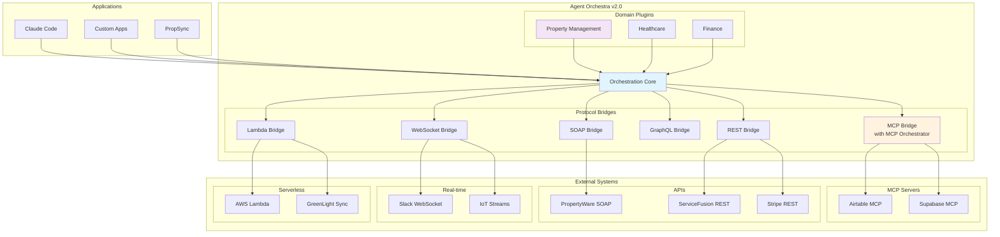

# 🎭 Agent Orchestra v2.0

> **The Ultimate Multi-Protocol Orchestration Platform**

[](https://github.com/rashidazarang/agent-orchestra)
[](https://opensource.org/licenses/MIT)
[](https://modelcontextprotocol.io/)
[]()
[](https://www.typescriptlang.org/)
[]()

## 🚀 What's New in v2.0

Agent Orchestra has evolved into the **ultimate orchestration backbone** for any integration scenario:

### 🔥 Major Enhancements

- **🌐 Multi-Protocol Support**: Not just MCP anymore! Now supports REST, SOAP, GraphQL, WebSocket, and Lambda
- **🏢 Domain System**: Build vertical-specific solutions (PropSync for property management included!)
- **🔗 Integrated MCP Orchestrator**: Our MCP Orchestrator is now a built-in module
- **🛠️ Protocol Bridges**: Seamlessly work across different API types
- **📦 Backward Compatible**: All v0.1.0 features still work

## 🌟 Overview

Agent Orchestra v2.0 is a universal orchestration platform that enables you to:
- **Orchestrate ANY System**: MCP servers, REST APIs, SOAP services, GraphQL endpoints, WebSockets, Lambda functions
- **Build Domain Solutions**: Create industry-specific orchestrators (property management, healthcare, finance)
- **Cross-Protocol Workflows**: Execute workflows that span multiple protocols
- **Enterprise Ready**: Production-grade with observability, security, and scaling

## 🎯 Why Agent Orchestra v2.0?

**The Problem**: Modern enterprises use dozens of systems with different protocols:
- Legacy SOAP APIs (PropertyWare, SAP)
- Modern REST APIs (Stripe, Twilio)
- MCP Servers (Airtable, Supabase)
- Real-time WebSockets (Chat, IoT)
- Serverless Functions (AWS Lambda)

**The Solution**: Agent Orchestra unifies ALL of them under one orchestration platform!

## 🏗️ Architecture v2.0



## 🚀 Quick Start

### Installation

```bash
# Clone the repository
git clone https://github.com/rashidazarang/agent-orchestra.git
cd agent-orchestra

# Install dependencies
npm install

# Build
npm run build
```

### Basic Usage (v2.0)

```typescript
import { createOrchestraV2 } from '@agent-orchestra/core';

// Create orchestra with multiple protocols
const orchestra = await createOrchestraV2({
  protocols: {
    mcp: true,      // MCP servers (Airtable, Supabase, etc.)
    rest: true,     // REST APIs
    soap: true,     // SOAP/XML services
    graphql: true,  // GraphQL endpoints
    websocket: true,// Real-time connections
    lambda: true    // Serverless functions
  }
});

// Initialize
await orchestra.initialize();

// Execute across any protocol!
await orchestra.execute('mcp', 'airtable.list_records', { table: 'Projects' });
await orchestra.execute('rest', 'stripe.get./v1/customers', { limit: 10 });
await orchestra.execute('soap', 'propertyware.GetPortfolios', { ... });
await orchestra.execute('lambda', 'syncData', { source: 'PW', dest: 'SF' });
```

## 💡 New Features in v2.0

### 1. Protocol Bridges

```typescript
// Add any MCP server
await orchestra.addMCPServer({
  name: 'airtable',
  package: '@rashidazarang/airtable-mcp'
});

// Add REST endpoint
orchestra.addRESTEndpoint({
  name: 'stripe',
  baseURL: 'https://api.stripe.com',
  auth: { type: 'bearer', credentials: { token: process.env.STRIPE_KEY } }
});

// Add SOAP service
orchestra.addSOAPService({
  name: 'propertyware',
  wsdl: 'https://api.propertyware.com/wsdl',
  auth: { type: 'oauth2', ... }
});

// Add Lambda function
orchestra.addLambdaFunction({
  name: 'greenlight-sync',
  handler: async (event) => { /* Your sync logic */ }
});
```

### 2. Domain System

Build vertical-specific solutions with the domain plugin system:

```typescript
import { PropertyManagementDomain } from '@agent-orchestra/domains';

// Register a domain
orchestra.registerDomain(new PropertyManagementDomain());

// Use domain-specific workflows
await orchestra.executeWorkflow('emergency-maintenance', {
  workOrderId: 'WO-123',
  priority: 'urgent'
});

await orchestra.executeWorkflow('monthly-reconciliation', {
  portfolio: 'Anderson',
  month: '2024-01'
});
```

### 3. Cross-Protocol Workflows

```typescript
// Define workflows that span multiple protocols
const workflow = {
  name: 'data-sync',
  steps: [
    { protocol: 'soap', operation: 'propertyware.GetWorkOrders' },
    { protocol: 'lambda', operation: 'transform-data' },
    { protocol: 'rest', operation: 'servicefusion.createJobs' },
    { protocol: 'mcp', operation: 'airtable.update_records' },
    { protocol: 'websocket', operation: 'notify-clients' }
  ]
};

await orchestra.executeWorkflow(workflow);
```

### 4. Integrated MCP Orchestrator

Our MCP Orchestrator is now built-in as a module:

```typescript
// All MCP servers managed through one interface
const mcpTools = await orchestra.listMCPTools();
// Returns tools from ALL connected MCP servers

// Smart routing across MCP servers
await orchestra.execute('mcp', 'sync_databases', {
  source: 'airtable',
  destination: 'supabase'
});
```

## 🏢 Domain Examples

### Property Management (PropSync Template)

```typescript
// Create PropSync-ready orchestra
const propSync = await createPropSyncOrchestra();

// Pre-configured with:
// - PropertyWare (SOAP + MCP)
// - ServiceFusion (REST + MCP)
// - GreenLight Sync (Lambda)
// - Supabase (REST + MCP)

// Execute property management workflows
await propSync.executeWorkflow('emergency-maintenance');
await propSync.executeWorkflow('tenant-move-in');
await propSync.executeWorkflow('monthly-reconciliation');
```

## 📦 What's Included

### Core Modules
- **Orchestration Engine** - Core workflow execution
- **Protocol Bridges** - Connect to any API type
- **Domain System** - Build vertical solutions
- **Agent Registry** - Manage agents across protocols
- **Workflow Engine** - Complex workflow patterns
- **Observability** - Monitoring and logging

### Protocol Support
| Protocol | Use Cases | Status |
|----------|-----------|---------|
| MCP | AI tools, modern integrations | ✅ Integrated |
| REST | Most modern APIs | ✅ Ready |
| SOAP | Legacy enterprise systems | ✅ Ready |
| GraphQL | Modern query APIs | ✅ Ready |
| WebSocket | Real-time, streaming | ✅ Ready |
| Lambda | Serverless, custom logic | ✅ Ready |

### Included Domains
- **Property Management** - Complete template for PropSync
- More domains coming soon!

## 🔧 Advanced Configuration

### Multi-Protocol Setup

```yaml
# orchestra.config.yml
protocols:
  mcp:
    servers:
      - name: airtable
        package: "@rashidazarang/airtable-mcp"
      - name: supabase
        package: "@supabase/mcp-server"
  
  rest:
    endpoints:
      - name: stripe
        baseURL: https://api.stripe.com
      - name: twilio
        baseURL: https://api.twilio.com
  
  soap:
    services:
      - name: propertyware
        wsdl: https://api.propertyware.com/wsdl
  
  lambda:
    functions:
      - name: sync-engine
        runtime: nodejs18
        handler: sync.handler

domains:
  - property-management
  - healthcare
  - finance
```

## 🤝 Building Your Own Domain

```typescript
import { Domain } from '@agent-orchestra/core';

export class HealthcareDomain implements Domain {
  name = 'healthcare';
  version = '1.0.0';
  
  getWorkflows() {
    return [
      {
        id: 'patient-admission',
        steps: [
          { protocol: 'rest', operation: 'epic.createPatient' },
          { protocol: 'mcp', operation: 'insurance.verify' },
          { protocol: 'soap', operation: 'legacy.updateRecords' }
        ]
      }
    ];
  }
}

// Register your domain
orchestra.registerDomain(new HealthcareDomain());
```

## 📊 Comparison: v0.1.0 vs v2.0

| Feature | v0.1.0 | v2.0 |
|---------|--------|------|
| MCP Support | ✅ Basic | ✅ Full with Orchestrator |
| REST APIs | ❌ | ✅ Complete |
| SOAP/XML | ❌ | ✅ Complete |
| GraphQL | ❌ | ✅ Complete |
| WebSocket | ❌ | ✅ Complete |
| Lambda | ❌ | ✅ Complete |
| Domain System | ❌ | ✅ Extensible |
| Cross-Protocol | ❌ | ✅ Full Support |
| Property Management | ❌ | ✅ Template Included |

## 🛠️ Development

### Testing
```bash
npm test
```

### Building
```bash
npm run build
```

### Running Examples
```bash
# Basic orchestration
npm run example:basic

# Property management
npm run example:propsync

# Multi-protocol
npm run example:multi-protocol
```

## 📚 Documentation

- [Getting Started](docs/getting-started.md)
- [Architecture Overview](docs/architecture.md)
- [Protocol Bridges](docs/protocols.md)
- [Domain System](docs/domains.md)
- [API Reference](docs/api-reference.md)
- [Migration from v0.1.0](docs/migration.md)

## 🎯 Use Cases

### For Enterprises
- **System Integration**: Unite legacy SOAP with modern REST/GraphQL
- **Process Automation**: Orchestrate workflows across all systems
- **Data Synchronization**: Keep multiple systems in sync

### For Developers
- **Multi-Protocol APIs**: Build APIs that aggregate multiple sources
- **Workflow Automation**: Create complex cross-system workflows
- **Domain Solutions**: Build vertical-specific platforms

### For Specific Industries
- **Property Management**: PropSync template ready to use
- **Healthcare**: Connect EHR, billing, insurance systems
- **Finance**: Integrate banking, payment, accounting systems

## 🗺️ Roadmap

### ✅ Completed (v2.0)
- [x] Multi-protocol support (6 protocols)
- [x] Domain plugin system
- [x] Integrated MCP Orchestrator
- [x] Property Management domain template
- [x] Cross-protocol workflows

### 🚧 In Progress
- [ ] Additional domains (Healthcare, Finance)
- [ ] Visual workflow designer
- [ ] Cloud deployment templates
- [ ] SDK for domain creation

### 📋 Planned
- [ ] AI-powered workflow generation
- [ ] Automatic protocol detection
- [ ] Distributed execution
- [ ] Enterprise authentication (SSO, SAML)

## 🤝 Contributing

We welcome contributions! Please see [CONTRIBUTING.md](CONTRIBUTING.md) for guidelines.

### How to Contribute
1. Fork the repository
2. Create your feature branch
3. Add your protocol bridge or domain
4. Submit a pull request

## 📄 License

MIT License - see [LICENSE](LICENSE) file for details

## 🙏 Acknowledgments

- Built on [Model Context Protocol](https://modelcontextprotocol.io/) by Anthropic
- Inspired by enterprise integration patterns
- Community contributions and feedback

## 📞 Support

- **Issues**: [GitHub Issues](https://github.com/rashidazarang/agent-orchestra/issues)
- **Discussions**: [GitHub Discussions](https://github.com/rashidazarang/agent-orchestra/discussions)
- **Twitter**: [@agentorchestra](https://twitter.com/agentorchestra)

## 🏆 Why Choose Agent Orchestra v2.0?

1. **Universal Compatibility**: Works with ANY API or protocol
2. **Domain Flexibility**: Build for any industry vertical
3. **Production Ready**: Enterprise-grade from day one
4. **Open Source**: MIT licensed, community-driven
5. **Future Proof**: Extensible architecture for new protocols

---

**Built with ❤️ by Rashid Azarang and the Open Source Community**

*Making universal orchestration accessible to everyone*