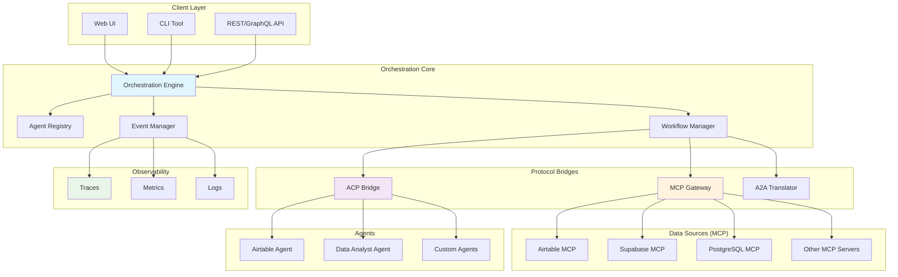

# 🎭 Agent Orchestra

> **Universal Multi-Agent Orchestration Framework**

[](https://opensource.org/licenses/MIT)
[](https://modelcontextprotocol.io/)
[]()
[]()
[](https://www.typescriptlang.org/)
[](https://www.python.org/)

## 🌟 Overview

Agent Orchestra is a production-ready, standards-based framework for orchestrating multiple AI agents across different protocols and data sources. It seamlessly integrates MCP (Model Context Protocol), ACP (Agent Communication Protocol), and A2A (Agent-to-Agent) standards to enable complex multi-agent workflows.

## 🎯 Key Features

- **🔌 Multi-Protocol Support** - MCP, ACP, A2A in a single framework
- **🗄️ Multiple Data Layers** - Airtable, Supabase, PostgreSQL, and more via MCP
- **🤖 Agent Registry** - Discover, register, and manage agents
- **🔄 Orchestration Patterns** - Sequential, parallel, hierarchical, and collaborative workflows
- **📊 Built-in Observability** - Traces, metrics, logs with OpenTelemetry
- **🔒 Enterprise Security** - OAuth2, API keys, role-based access control
- **⚡ High Performance** - Async/await, connection pooling, caching
- **🎨 Visual Workflow Designer** - Drag-and-drop interface (coming soon)

## 🏗️ Architecture



## 🚀 Quick Start

### Installation

```bash
# Clone the repository
git clone https://github.com/rashidazarang/agent-orchestra.git
cd agent-orchestra

# Install dependencies
npm install
pip install -r requirements.txt

# Configure environment
cp .env.example .env
# Edit .env with your credentials

# Start the orchestrator
npm run start
```

### Docker Deployment

```bash
# Start all services
docker-compose up -d

# Check status
docker-compose ps

# View logs
docker-compose logs -f orchestrator
```

## 💡 Usage Examples

### Example 1: Simple Sequential Workflow

```typescript
import { Orchestra } from '@agent-orchestra/core';

const orchestra = new Orchestra();

// Define workflow
const workflow = orchestra.createWorkflow({
  name: 'data-processing',
  pattern: 'sequential'
});

// Add steps
workflow
  .addStep('fetch-data', {
    agent: 'airtable-agent',
    action: 'list_records',
    params: { table: 'Projects' }
  })
  .addStep('analyze', {
    agent: 'analyst-agent',
    action: 'analyze_data',
    input: '{{fetch-data.output}}'
  })
  .addStep('store-results', {
    agent: 'supabase-agent',
    action: 'insert',
    params: { 
      table: 'analytics',
      data: '{{analyze.output}}'
    }
  });

// Execute
const result = await workflow.execute();
```

### Example 2: Parallel Multi-Agent Collaboration

```python
from agent_orchestra import Orchestra, ParallelWorkflow

orchestra = Orchestra()

# Create parallel workflow
workflow = ParallelWorkflow("multi-source-aggregation")

# Add parallel tasks
workflow.add_parallel_tasks([
    {
        "agent": "airtable-agent",
        "action": "fetch_sales_data",
        "params": {"table": "Sales", "view": "This Month"}
    },
    {
        "agent": "supabase-agent", 
        "action": "fetch_inventory",
        "params": {"query": "SELECT * FROM inventory WHERE stock < 100"}
    },
    {
        "agent": "analytics-agent",
        "action": "fetch_market_trends",
        "params": {"source": "external_api"}
    }
])

# Add aggregation step
workflow.add_aggregation_step({
    "agent": "orchestrator",
    "action": "combine_insights",
    "wait_for": "all"
})

# Execute and get results
results = await orchestra.execute(workflow)
```

### Example 3: Hierarchical Agent Management

```typescript
// Create supervisor agent
const supervisor = orchestra.createSupervisor({
  name: 'project-manager',
  capabilities: ['task-delegation', 'progress-monitoring']
});

// Register sub-agents
supervisor.registerSubAgent('researcher', researchAgent);
supervisor.registerSubAgent('writer', writerAgent);
supervisor.registerSubAgent('reviewer', reviewAgent);

// Define complex task
const task = {
  goal: 'Create comprehensive market analysis report',
  deadline: '2025-01-15',
  requirements: ['data-collection', 'analysis', 'visualization', 'report-writing']
};

// Let supervisor orchestrate
const report = await supervisor.executeTask(task);
```

## 🔧 Configuration

### MCP Servers Configuration

```yaml
# config/mcp-servers.yaml
servers:
  airtable:
    package: "@rashidazarang/airtable-mcp"
    version: "3.2.4"
    config:
      auth: "${AIRTABLE_TOKEN}"
      base: "${AIRTABLE_BASE_ID}"
    
  supabase:
    package: "@supabase/mcp-server"
    version: "1.0.0"
    config:
      url: "${SUPABASE_URL}"
      key: "${SUPABASE_KEY}"
      
  postgres:
    package: "@mcp/postgres"
    version: "2.0.0"
    config:
      connection: "${DATABASE_URL}"
      
  custom:
    path: "./custom-mcp-servers"
    config:
      custom_param: "value"
```

### Agent Registry

```yaml
# config/agents.yaml
agents:
  airtable-ai-agent:
    type: "mcp-client"
    server: "airtable"
    capabilities:
      - data-manipulation
      - schema-management
      - webhook-handling
    
  data-analyst:
    type: "reasoning"
    model: "gpt-4"
    tools:
      - statistical-analysis
      - visualization
      - reporting
      
  orchestrator:
    type: "supervisor"
    capabilities:
      - task-planning
      - agent-coordination
      - error-recovery
```

## 📊 Observability

### Built-in Dashboards

- **Agent Performance** - Response times, success rates, token usage
- **Workflow Analytics** - Execution paths, bottlenecks, optimization suggestions
- **System Health** - Resource usage, error rates, availability

### Metrics Export

```typescript
// Export to Prometheus
orchestra.metrics.exportTo('prometheus', {
  endpoint: 'http://localhost:9090',
  interval: 30000
});

// Export to DataDog
orchestra.metrics.exportTo('datadog', {
  apiKey: process.env.DATADOG_API_KEY,
  site: 'datadoghq.com'
});
```

## 🛠️ Advanced Features

### Custom Orchestration Patterns

```typescript
// Define custom pattern
orchestra.registerPattern('round-robin', {
  selector: (agents, task) => {
    // Custom logic for agent selection
    return agents[task.attempt % agents.length];
  },
  errorHandler: (error, context) => {
    // Custom error recovery
    return context.retry({ maxAttempts: 3 });
  }
});
```

### Protocol Bridges

```typescript
// Bridge MCP to ACP
const bridge = orchestra.createBridge('mcp-to-acp');
bridge.translate({
  from: 'mcp-tool-call',
  to: 'acp-agent-message',
  transformer: (mcpData) => ({
    type: 'task',
    payload: mcpData.params,
    sender: 'mcp-gateway',
    timestamp: Date.now()
  })
});
```

## 📦 Modules

### Core Modules

- **orchestrator** - Core orchestration engine
- **mcp-gateway** - MCP server management
- **acp-bridge** - ACP protocol support
- **a2a-translator** - Cross-framework translation
- **agent-registry** - Agent discovery and management
- **workflow-engine** - Workflow execution
- **observability** - Monitoring and logging

### Extension Modules

- **visual-designer** - Drag-and-drop workflow builder
- **marketplace** - Agent and workflow marketplace
- **security** - Enhanced security features
- **analytics** - Advanced analytics and insights

## 🤝 Contributing

We welcome contributions! Please see [CONTRIBUTING.md](CONTRIBUTING.md) for guidelines.

### Development Setup

```bash
# Clone repository
git clone https://github.com/rashidazarang/agent-orchestra.git
cd agent-orchestra

# Install development dependencies
npm install --dev
pip install -r requirements-dev.txt

# Run tests
npm test
pytest tests/

# Run linting
npm run lint
python -m flake8 src/
```

## 📚 Documentation

- [Getting Started Guide](docs/getting-started.md)
- [Architecture Overview](docs/architecture.md)
- [API Reference](docs/api-reference.md)
- [Orchestration Patterns](docs/patterns.md)
- [Protocol Specifications](docs/protocols.md)
- [Examples](examples/)

## 🎯 Roadmap

### Phase 1: Foundation (Q1 2025) ✅
- [x] Core orchestration engine
- [x] MCP gateway with multiple servers
- [x] Basic agent registry
- [x] Sequential and parallel patterns

### Phase 2: Advanced Features (Q2 2025) 🚧
- [ ] ACP bridge implementation
- [ ] A2A translator
- [ ] Hierarchical orchestration
- [ ] Visual workflow designer

### Phase 3: Enterprise (Q3 2025) 📋
- [ ] Advanced security features
- [ ] Marketplace integration
- [ ] Custom protocol support
- [ ] Cloud-native deployment

### Phase 4: AI-Native (Q4 2025) 🔮
- [ ] Self-optimizing workflows
- [ ] Automatic agent discovery
- [ ] Predictive orchestration
- [ ] Natural language workflow definition

## 📄 License

MIT License - see [LICENSE](LICENSE) file for details

## 🙏 Acknowledgments

- Built on [Model Context Protocol](https://modelcontextprotocol.io/) by Anthropic
- Inspired by [LangGraph](https://langchain-ai.github.io/langgraph/) and [CrewAI](https://crewai.com/)
- Uses [@rashidazarang/airtable-mcp](https://github.com/rashidazarang/airtable-mcp) for Airtable integration
- Community contributions and feedback

## 📞 Support

- **Issues**: [GitHub Issues](https://github.com/rashidazarang/agent-orchestra/issues)
- **Discussions**: [GitHub Discussions](https://github.com/rashidazarang/agent-orchestra/discussions)
- **Discord**: [Join our Discord](https://discord.gg/agent-orchestra)
- **Twitter**: [@agenторchestra](https://twitter.com/agentorchestra)

---

**Built with ❤️ by Rashid Azarang**

*Making multi-agent orchestration accessible to everyone*
